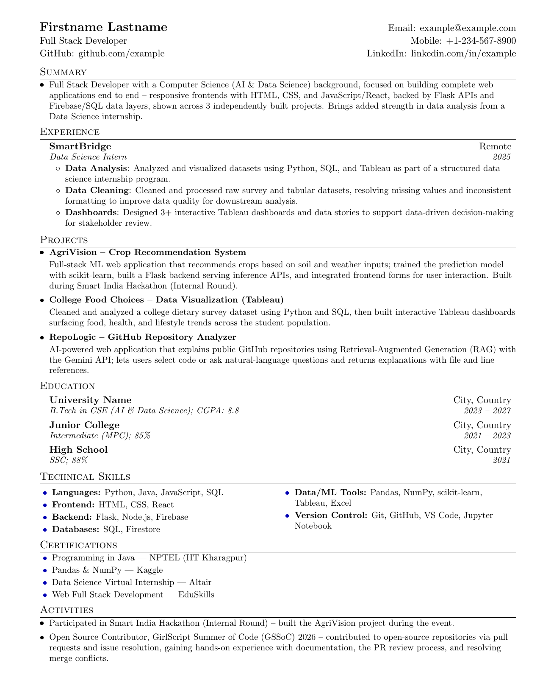

# resume

My personal resume, written in LaTeX.

[](resume.pdf)

I built this after looking at a couple of other LaTeX resume templates floating around GitHub — figured I'd put mine here too in case it's useful to someone, or just so I have a clean copy I can pull up and edit anytime.

## Building it

You'll need a LaTeX distro (TeX Live works fine) with `pdflatex` installed.

```bash
pdflatex resume.tex
```

That spits out `resume.pdf`. Run it twice if the formatting looks slightly off on the first pass — normal LaTeX thing.

## What's in here

- `resume.tex` — the source, edit this
- `resume.pdf` — the compiled version
- `resume.png` — quick preview image for this README

## License

MIT — feel free to fork it and make it your own.
